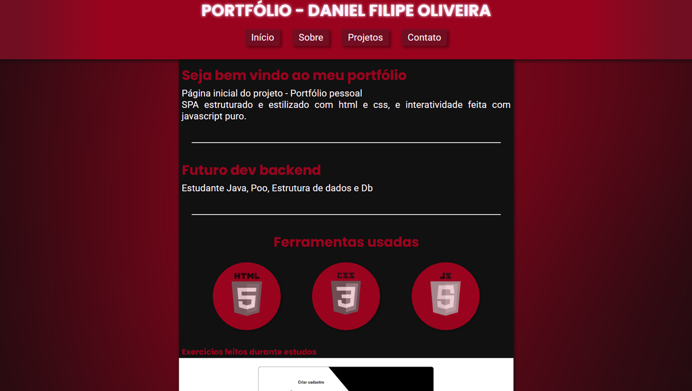
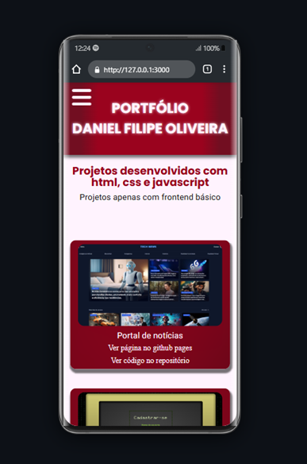

# Portfólio pessoal - Daniel Filipe Oliveira
Projeto para atividade - Ferramentas de desenvolvimento Web: Ensino Superior em Análise e Desenvolvimento de Sistemas - Uninter

Previsto último projeto com frontend - Html, Css e Js 
Portfolio responsivo frontend em SPA  
Algumas técnicas usadas foram, api no label/input para meu email, media-queries, menu de sidebar no modo mobile, botão de troca de tema escuro-claro, html injection com js, iframe...

[**👉Portfólio pessoal - Github Pages👈**](https://oliveira-super.github.io/portfolio_pessoal_cv_online/) 
 

Acessível a dispositivos móveis - com versão responsiva 🟢

